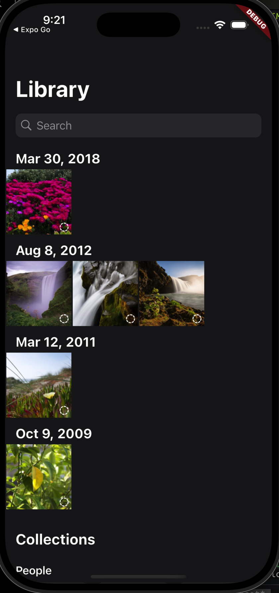
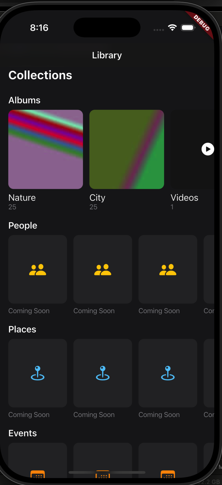
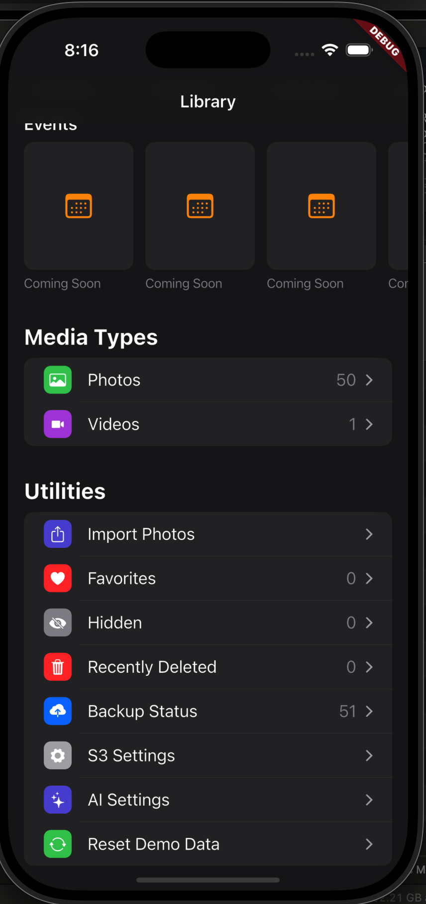

# Bring Your Own Photos

Flutter app (iOS first, Android backlog) that backs up Photos/Videos to your own S3 bucket, with thumbnail-first browsing and storage tiering via your bucket's own Lifecycle Rules. Localized (English, Mandarin) from the start.

Design: `docs/design/DESIGN.md`
UI/UX: `docs/design/UIUX-DESIGN.md`
Plan: `docs/design/IMPLEMENTATION_PLAN.md`

## Setup

```
./scripts/bootstrap-flutter.sh   # clones Flutter SDK locally into .tools/, no system install
.tools/flutter/bin/flutter run
```

Or, if you already have Flutter installed system-wide: `flutter run`.

### iCloud backup is built but not switched on in this project

The app data backup (Settings → App Data) writes to an iCloud Drive
container. Everything for it is here — `ios/Runner/Runner.entitlements`,
`ICloudDriveChannel.swift`, the Dart side — except the one line that would
make every build of the app need it: the Runner target does **not** set
`CODE_SIGN_ENTITLEMENTS`.

That's deliberate. The entitlement only signs against a provisioning profile
whose App ID has the iCloud capability and the
`iCloud.com.example.backYourOwnPhotos` container registered, which is a
paid Apple Developer Program thing. Adding the entitlement without that turns
every `flutter build ios` into:

```
Provisioning profile "iOS Team Provisioning Profile: com.example.backYourOwnPhotos"
doesn't match the entitlements file's values for the
com.apple.developer.ubiquity-container-identifiers and
com.apple.developer.icloud-container-identifiers entitlements.
```

To turn it on with a paid account: open `ios/Runner.xcworkspace`, Runner
target → Signing & Capabilities → + Capability → iCloud → tick iCloud
Documents → add the container. Xcode writes the entitlement setting itself.

Until then the app builds and runs as before, and the iCloud row reads "This
build of the app isn't signed for iCloud" with its switch disabled — the
state it's written to handle.

## Screenshots

**Photo Library**


**Collections**


**Media Types & Utilities**

